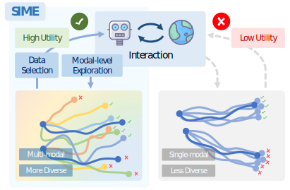

# SIME: Enhancing Policy Self-Improvement with Modal-level Exploration

[[Project page]](https://ericjin2002.github.io/SIME/) [[Paper]](https://arxiv.org/abs/2505.01396) [[Code]](https://github.com/EricJin2002/SIME)



## Installation

1. Create a new conda environment and activate the environment. We recommend using Python 3.8 and CUDA 11.7. We have tested the code on Ubuntu 20.04, NVIDIA RTX 3090 and NVIDIA A100 GPUs.
```bash
conda create -n sime python=3.8
conda activate sime
conda install pytorch==1.13.0 torchvision==0.14.0 pytorch-cuda=11.7 -c pytorch -c nvidia
```

2. Install the required packages.
```bash
pip install -r requirements.txt
```

3. Install [Pytorch3D](https://github.com/facebookresearch/pytorch3d) from source.
```bash
mkdir dependencies && cd dependencies
git clone git@github.com:facebookresearch/pytorch3d.git
cd pytorch3d
pip install -e .
cd ../..
```

4. To install [robomimic](https://github.com/ARISE-Initiative/robomimic), follow the official [guide](https://robomimic.github.io/docs/introduction/installation.html). We recommend installing from source for better compatibility and performance. To reproduce the results, please consider using this [commit](https://github.com/ARISE-Initiative/robomimic/commit/9273f9cce85809b4f49cb02c6b4d4eeb2fe95abb).
```bash
cd dependencies
git clone https://github.com/ARISE-Initiative/robomimic.git
cd robomimic
pip install -e .
cd ../..
```

5. (Optional) If you encounter the following error when running the simulation experiments, please consider applying this [patch](https://github.com/ARISE-Initiative/robomimic/commit/8df6e8e482458befaf1decfcd9d635d68a7afcae) for `robomimic` package, which aims to "protect against missing mujoco-py module, since robosuite might be using mujoco-py or DM backend".
```bash
ModuleNotFoundError: No module named 'mujoco_py'
```

## Reproducing Simulation Benchmark Results

### Datasets

We use the [robomimic](https://github.com/ARISE-Initiative/robomimic) benchmark for simulation experiments. Please follow the [instructions](https://robomimic.github.io/docs/datasets/robomimic_v0.1.html) to download the low-dim datasets.
```bash
cd simulation && python download_datasets.py --tasks sim --dataset_types ph --hdf5_types low_dim --download_dir datasets
```

(Optional) The image datasets can be converted from the low-dim datasets.
```bash
cd simulation && bash extract_obs_from_raw_datasets.sh
```
### Full Pipeline

We provide a single script, `run_full.py`, which integrates the entire *SIME* pipeline. To reproduce the experiments, simply run the following command.

#### single round, state based observation


```bash
cd simulation
# lift
python run_full.py --dataset datasets/lift/ph/low_dim_v141.hdf5 --output_dir out/lift/ --used_demo core_10 --task lift --seeds 233 2333 23333 233333 --cuda_device 0 1 2 3 --noise_scale 0.01
# can
python run_full.py --dataset datasets/can/ph/low_dim_v141.hdf5 --output_dir out/can/ --used_demo core_20 --task can --seeds 233 2333 23333 233333 --cuda_device 0 1 2 3 --noise_scale 0.01
# square
python run_full.py --dataset datasets/square/ph/low_dim_v141.hdf5 --output_dir out/square/ --used_demo core_20 --task square --seeds 233 2333 23333 233333 --cuda_device 0 1 2 3 --noise_scale 0.01
# transport
python run_full.py --dataset datasets/transport/ph/low_dim_v141.hdf5 --output_dir out/transport/ --used_demo core_20 --task transport --seeds 233 2333 23333 233333 --cuda_device 0 1 2 3 --noise_scale 0.01
# tool_hang
python run_full.py --dataset datasets/tool_hang/ph/low_dim_v141.hdf5 --output_dir out/tool_hang/ --used_demo core_40 --task tool_hang --seeds 233 2333 23333 233333 --cuda_device 0 1 2 3 --noise_scale 0.01
```

#### single round, image based observation

```bash
cd simulation
# lift
python run_full.py --dataset datasets/lift/ph/image_v141.hdf5 --output_dir out/lift_image/ --used_demo core_10 --task lift_image --seeds 233 2333 23333 233333 --cuda_device 0 1 2 3 --noise_scale 0.5
# can
python run_full.py --dataset datasets/can/ph/image_v141.hdf5 --output_dir out/can_image/ --used_demo core_20 --task can_image --seeds 233 2333 23333 233333 --cuda_device 0 1 2 3 --noise_scale 0.5
# square
python run_full.py --dataset datasets/square/ph/image_v141.hdf5 --output_dir out/square_image/ --used_demo core_20 --task square_image --seeds 233 2333 23333 233333 --cuda_device 0 1 2 3 --noise_scale 0.5
# transport
python run_full.py --dataset datasets/transport/ph/image_v141.hdf5 --output_dir out/transport_image/ --used_demo core_20 --task transport_image --seeds 233 2333 23333 233333 --cuda_device 0 1 2 3 --noise_scale 0.5
# tool_hang
python run_full.py --dataset datasets/tool_hang/ph/image_v141.hdf5 --output_dir out/tool_hang_image/ --used_demo core_40 --task tool_hang_image --seeds 233 2333 23333 233333 --cuda_device 0 1 2 3 --noise_scale 0.5
```

#### multiple round

To run the multi-round experiments, use the `run_full_multi_round.py` script. The following command provides an example on the *can* task.
```bash
cd simulation
python run_full_multi_round.py --dataset datasets/can/ph/low_dim_v141.hdf5 --output_dir out/can_multi_round/ --used_demo core_20 --task can --seeds 233 2333 23333 233333 --cuda_device 0 1 2 3 --noise_scale 0.01
```

---

Besides the full pipeline, we also provide individual scripts for each step of the pipeline. The following sections will describe the details of each step.

### Policy Training

To train the policy, a configuration file is required. The config specifies the hyperparameters and the training settings, such as output log directory, dataset path, saving frequency, etc. Examples of the config can be found in `src/config`, `simulation/config_template`, and `realworld/config`.

#### to train on a single GPU

```bash
cd src && torchrun --standalone --nproc_per_node=gpu train.py --config /path/to/config.json
```

#### to train on multiple GPUs

```bash
cd src && CUDA_VISIBLE_DEVICES=0,1,2,3 torchrun --nnodes 1 --rdzv_backend c10d --rdzv_endpoint localhost:0 --nproc_per_node=gpu train.py --config /path/to/config.json
```

### Evaluation and Data Collection

To evaluate the policy, run the following command, which will initiate 100 different states and conduct 5 trials for each initial state. 
```bash
cd simulation && python run.py --agent /path/to/logs/task/timestamp/ckpt/policy_last.ckpt --config /path/to/logs/task/timestamp/config.json --n_rollouts 500 --seed 233 --try_times 5 --abs_action --dataset_path /path/to/output/demo.hdf5 --video_dir /path/to/output --dataset_obs --render_traj --return_intermediate
```
For the detailed definition of the arguments, please refer to the `run.py` script. After the evaluation, a HDF5 form dataset will be generated in the specified directory.

The performance metric, success rate, is calculated and printed in the console. A script is also provided to count the success rate from the generated dataset.
```bash
cd simulation && python get_dataset_success_rate.py --dataset /path/to/output/demo.hdf5
```

### Modal-level Exploration

To enable the proposed modal-level exploration, add the following argument to the `run.py` script. 
```
 --enable_exploration --noise_scale 0.01
```
For state-based observation, we recommend using a small noise scale, such as 0.01. For image-based observation, a larger noise scale, such as 0.5, is recommended.

### Data Selection

After the evaluation, we use the collected dataset to refine the policy. Before re-training the policy, we conduct data selection as follows.

#### Inter-demo Selection

The following commands extract the useful data and save it in the masks of the dataset.

```bash
cd simulation
python extract_useful_data.py --dataset /path/to/output/demo.hdf5 --output_key sr_lss_0.9 --threshold 0.9 --same_init_state_repeated_times 5
python extract_useful_data.py --dataset /path/to/output/demo.hdf5 --output_key sr_lss_0.5 --threshold 0.5 --same_init_state_repeated_times 5
python extract_useful_data.py --dataset /path/to/output/demo.hdf5 --output_key sr_lss_0.3 --threshold 0.3 --same_init_state_repeated_times 5
python extract_useful_data.py --dataset /path/to/output/demo.hdf5 --output_key success --threshold 1.01 --same_init_state_repeated_times 5
```

To form the final dataset, we merge the masked data and the initially provided expert demonstrations. A configuration file is thus required to specify the source and the destination keys. An example of this config is provided in `simulation/dataset_combine_cfg.json`.

```bash
cd simulation && python dataset_combine.py --config dataset_combine_cfg.json
```

#### Intra-demo Selection

We provide a script to enable the manual filtering. To conduct the intra-demo selection, please remove unwanted frames of the generated dataset and run the following command.

```bash
cd simulation && python dataset_manually_filter.py --dataset /path/to/output/demo.hdf5 --output_name demo_manually_filtered.hdf5 --filtered_dir /path/to/output
```

### Policy Refinement

After the data selection, we re-train the policy using the selected data. This is similar to the policy training step, but with a different dataset path. One can also initiate the policy weights from the previous policy by specifying the `resume_ckpt` value in the config.

## Running on a Real Robot

To set up the real-world experiments, we use a Flexiv Rizon41 robot arm equipped with a Robotiq 2F-852 gripper. The gripper finger is changed to TPU soft finger3. We set up 2 RealSense D435i4 depth cameras to observe the
environment, one mounted on the robot wrist and the other fixed on a side perspective. We use a simga.7 haptic interface to teleoperate the robot arm and collect demonstrations.

To run the real-world experiments, make sure you have the [Flexiv RDK](https://github.com/flexivrobotics/flexiv_rdk), [Sigma SDK](https://www.forcedimension.com/software/sdk), [RealSense SDK](https://pypi.org/project/pyrealsense2/), and [keyboard monitoring library](https://pypi.org/project/pynput/) installed.

### Expert Demonstration Collection

Modify the `camera_serial` and `path_prefix` (to save the demonstrations) in the `realworld/teleoperate.py` script and run it to collect the expert demonstrations.

```bash
cd realworld && python teleoperate.py
```

### Policy Training

To train the policy, you need to provide a configuration file. An example is provided in the `realworld/config/two_cup_2_21.json`. After setting up the config, please refer to the simulation section and `realworld/command_train.sh` script to train the policy.

### Data Collection and Selection

To evaluate the policy, run the following command. The detailed arguments can be found in the `realworld/eval.py` script. By default, the script will save the image observations and actions of the evaluation in the specified `record_path`. 

```bash
python eval.py --config /path/to/logs/task/timestamp/config.json --ckpt /path/to/logs/task/timestamp/ckpt/policy_last.ckpt --num_action 20 --num_inference_step 20 --max_steps 1000 --seed 233 --discretize_rotation --ensemble_mode act --vis --record --record_path /path/to/record/path
```

Similar to the simulation experiments, to enable modal-level exploration, add `--enable_exploration` to the command.

After the data collection, we provide a script `realworld/clean_data.py` to clean the collected data. One can also manually filter the data by removing unwanted frames.

### Policy Refinement

The policy refinement step is the same as the simulation experiments. Please refer to the simulation section for the detailed procedure.

## Acknowledgement

Parts of our code are adapted from [Diffusion Policy](https://github.com/real-stanford/diffusion_policy), [RISE](https://github.com/rise-policy/rise), [robomimic](https://github.com/ARISE-Initiative/robomimic), and [S2I](https://github.com/Junxix/S2I). We thank the authors for their excellent work and open-source code.

## Citation

If you find this code useful, please consider citing our paper.

```
TBA
```